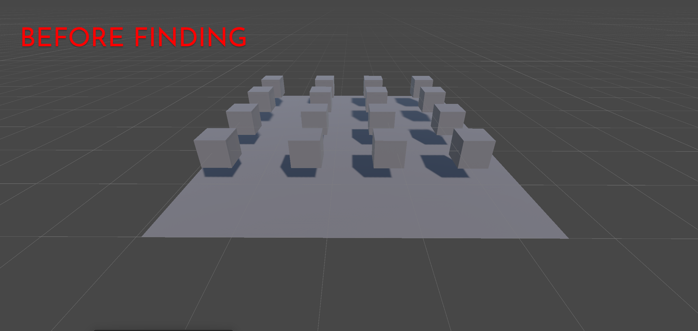
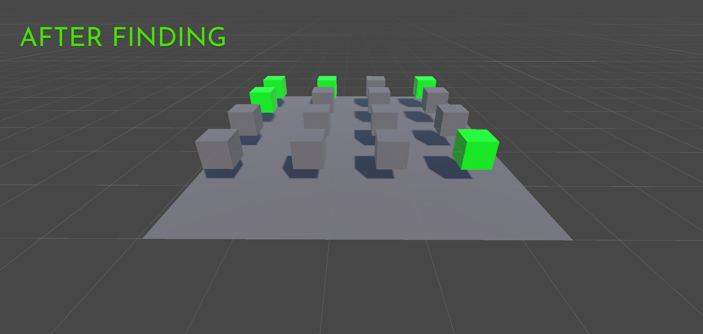
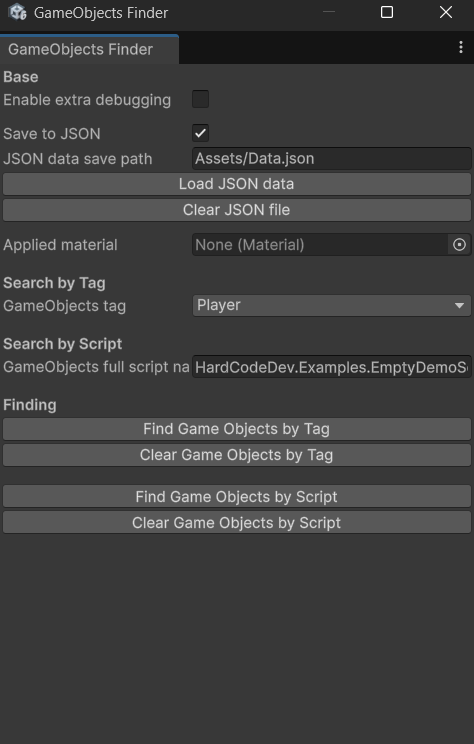


# 🧩 GameObjects Finder — Unity Editor Tool

> 🔎 Find, highlight, and manage GameObjects in your scene by **Tag** or **Script** — with material swapping, JSON saving, and verbose debug logging.

  

---

## 🚀 Overview

**GameObjects Finder** is a powerful Unity Editor utility designed to help you quickly locate and manage GameObjects in your scene using:

- 🎯 **Tag-based search**
- 🔧 **Script-based search**
- 🎨 **Automatic material assignment to found GameObjects**
- 💾 **JSON export & import**
- 🐛 **Verbose debug logging**

Use it during level design, debugging, or testing to instantly locate and visualize the objects you're working with.

---

## 📦 Installation

1. Download the ZIP archive.  
2. Unzip and place the `GameObjectsFinder` folder inside your project's `Assets/` directory.  
3. Unity will automatically compile the editor extension.  

No additional setup required.

---

## 🧰 Usage

Open the utility from the top Unity menu:  
`Finder → GameObjects Finder`.

Once opened, you’ll see the following window:

The interface is divided into several sections that allow you to configure search settings, apply materials, and work with saved data.

---

### ⚙️ Base Settings

| Setting                 | Description                                                                 |
|------------------------|-----------------------------------------------------------------------------|
| **Enable extra debug** | Enables verbose logging in the Console. Errors will also appear here.       |
| **Save to JSON**       | If checked, all found GameObjects will be saved to a JSON file.             |
| **JSON data path**     | Path to save or load JSON data (e.g. `Assets/Data.json`).                   |
| **Clear JSON file**    | Clears all content from the selected JSON file.                             |
| **Applied material**   | The material to apply to all found objects. Drag & drop a material here.    |

---

### 🏷️ Search by Tag

| Setting                 | Description                                                                 |
|------------------------|-----------------------------------------------------------------------------|
| **GameObjects tag**     | Select the tag you want to search for using the dropdown.                  |

---

### 🧠 Search by Script

| Setting                        | Description                                                                 |
|-------------------------------|-----------------------------------------------------------------------------|
| **GameObjects full script name** | Type the full name of the script, including its namespace, to search by.  |

---

### 🔍 Finding

| Action                        | Description                                                                 |
|------------------------------|-----------------------------------------------------------------------------|
| **Find GameObjects by tag**    | Finds all GameObjects (even those without a MeshRenderer) with the selected tag. |
| **Find GameObjects by script** | Finds all GameObjects (even those without a MeshRenderer) that have a component matching the script name. |

---

> 📌 **Note:** This is an **Editor-only tool**. It works inside the Unity Editor and does not require adding any MonoBehaviours to your scene.

---

## 🧪 Demo Scene

The package includes a ready-to-use demo scene:

- A flat plane with 16 spawn points  
- A `CubeSpawner` button that spawns 16 randomized cubes  
- Some cubes:
  - Are tagged as **`Player`**
  - Have the script **`EmptyDemoScript`** attached  
- Others are plain cubes without tags or scripts

Use the GameObjects Finder tool to test searching, filtering, and applying materials — only cubes with matching tags or scripts will be affected.

---

## 📄 License

This tool is licensed under the **HardCodeDev License** (based on MIT).  
You may:
- Use, modify, and distribute it freely  

But you **may not**:
- Sell this script as a standalone product or as part of a paid script collection

See [`LICENSE.txt`](LICENSE.txt) for full terms.

---

## 👨‍💻 Author

**HardCodeDev**  
- 🌐 [GitHub](https://github.com/HardCodeDev777)  
- 🎮 [Itch.io](https://hardcodedev.itch.io/)

---

> 💬 Have suggestions, found bugs, or want to contribute? Open an issue or fork the project on GitHub!

